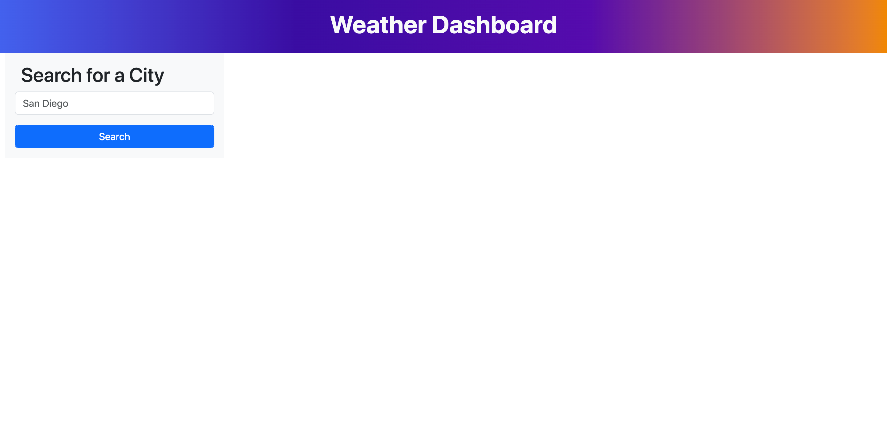

# Weather Dashboard

## Description
For this project I had to use the API's on https://openweathermap.org/ to fetch weather data for any city put into the search bar by the user. To do this I created the HTML and used bootstrap as my CSS framework to design the page to resemble the image provided to me with some minor tweaks that I felt made the design a bit more interesting. Next I started working on the functionality using javascript. I first created an event listener for the form so every time the form was submitted, it would use my functions to fetch and display the proper data. I then had to create a function that used the geocoder API to be able to take the city entered by the user, and fetch the data to get the latitude and longitude of that city that I can then use within my other functions in order to get the data I needed for the rest of the functionality. Once that was done, I then created a function to take in the latitude and longitude of the city pulled with the getGeo function in order to fetch the data for the temp, wind, and humidity. I then appended that data into the relevant elements in my html so that it displayed the city searched by the user, the current date using dayjs, the icon used to symbolize the type of weather, the temp in °F, the wind speed in mph, and the humidity percentage. After that I created a function to take in the latitude and longitude from the getGeo in order to fetch the data for the 5 day forecast in that city. I then created elements in my javascript and appended them to the appropriate places within my HTML to get them to display directly under the current weather data in that city. After that, all that was left to do was create a function that would clear out the innerhtml of the elements every time the submit button was used, so my code could repopulate it with the new data. I still need to use local storage to save every input entered by the user, and then display it as a search history, but at the moment I don't have time, so I'll resubmit once I get around to finishing that up.

## Acceptance Criteria
```
GIVEN a weather dashboard with form inputs
WHEN I search for a city
THEN I am presented with current and future conditions for that city and that city is added to the search history
WHEN I view current weather conditions for that city
THEN I am presented with the city name, the date, an icon representation of weather conditions, the temperature, the humidity, and the wind speed
WHEN I view future weather conditions for that city
THEN I am presented with a 5-day forecast that displays the date, an icon representation of weather conditions, the temperature, the wind speed, and the humidity
WHEN I click on a city in the search history
THEN I am again presented with current and future conditions for that city
```

## Visuals

.png)

## Resources

[Deployed Site](https://brady-billeisen.github.io/weather-dashboard/)

[GitHub Repository](https://github.com/brady-billeisen/weather-dashboard)

## Licenses
For this project I used an MIT license.